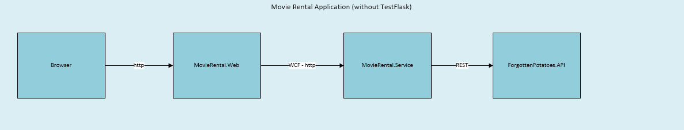
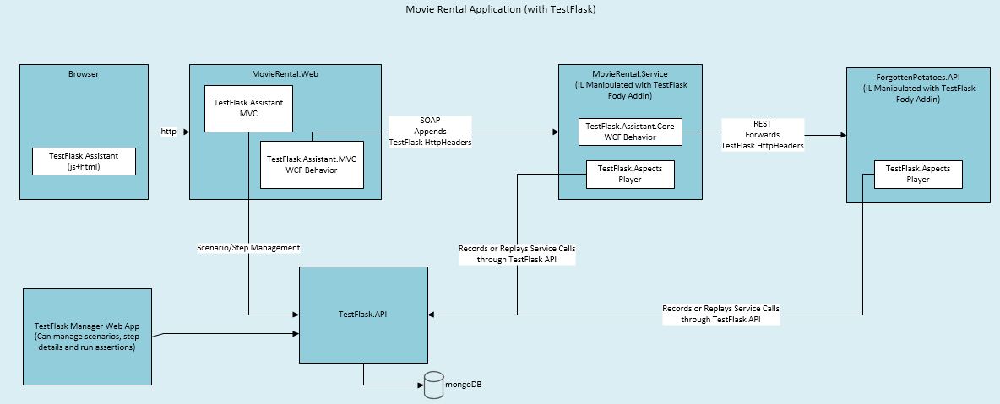
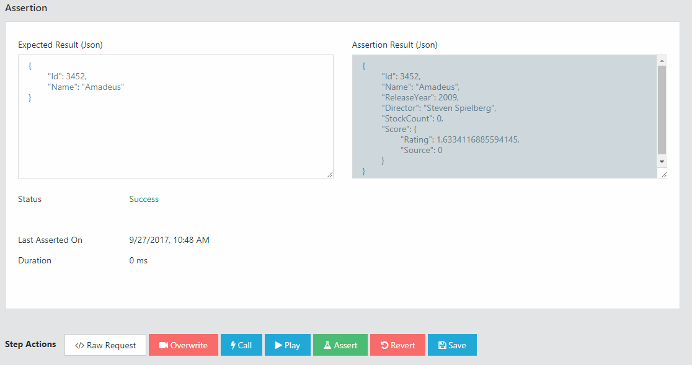

# MovieRental - TestFlask Sample App

This repo contains a sample web app (MovieRental.Web) and a sample WCF service solution (MovieRental.Service)  that is weaved with [TestFlask](https://github.com/FatihSahin/test-flask) Fody addin. 

TestFlask examples, docs and wikis will be based on that sample service solution as much as possible. It is a fictional movie rental service that exposes information about movies and their stock state. There is nothing special about the service operations. (AddMovie, DeleteMovie, RentMovie). To demonstrate TestFlask, service and web ui will be kept simple.

## How to build MovieRental for TestFlask 

* This sample solution uses four TestFlask nuget packages. However, I have not deployed them to nuget.org yet. In order to create TestFlask nuget packages, clone [test-flask](https://github.com/FatihSahin/test-flask) repo

* Build [test-flask](https://github.com/FatihSahin/test-flask) solution first, after that you need to prepare three nuget packages. You should create a folder in your machine to use it as nuget local repo. Configure your VS to use that local nuget repo as well.

    1. Copy TestFlaskAddin.Fody package to your local nuget repo folder (This package will already be prepared inside NugetBuild folder when you properly build test-flask solution)

    2. Open TestFlask.Aspects folder in command prompt and run "nuget pack". Copy TestFlask.Aspects.nupkg to your local nuget repo folder.

    3. Open TestFlask.Assistant.Core folder and again run "nuget pack". Copy TestFlask.Assistant.Core package to your local nuget repo.

    4. Open TestFlask.Assistant.Mvc folder and again run "nuget pack". Copy TestFlask.Assistant.Mvc package to your local nuget repo as well.

* After preparing packages, build MovieRental solution. If you come across a problem that says MS build could not copy some dlls to desired folders, kill MSBuild.exe processes that are open with Task Manager, and after that try to build solution again.

## What happens behind the scenes?

*   If you hopefully managed to build MovieRental solution, there are some interesting things to observe. Open up your MovieRental.Service bin folder. Delete if any MovieRental.Service.pdb file exists to make sure that decompilers should decompile your assembly from scratch. Decompile your MovieRental.Service.dll with a decompiler tool like (dotPeek, justDecompile, ILSpy or ildasm etc.).

* You should see your methods that are marked with [Playback] attribute are now weaved with the following structure. 

    * Original GetMovieWithStockCount method

    ```csharp
    [Playback(typeof(MovieNameIdentifier))]
    public Movie GetMovieWithStockCount(string name)
    {
        //simulate a delay
        Thread.Sleep(new Random().Next(500, 2000));
        //gets movie info from info service
        var movie = infoService.GetMovieInfo(name);
        //obtain stock info from stock service
        movie.StockCount = stockService.GetStock(name);
        
        return movie;
    }
    ```

    * Weaved GetMovieWithStockCount method

    ```csharp   
    [Playback(typeof (MovieNameIdentifier), null)]
    public Movie GetMovieWithStockCount(string name)
    {
        FuncPlayer<string, Movie> player = new FuncPlayer<string, Movie>("MovieRental.Models.Movie MovieRental.Business.RentalManager::GetMovieWithStockCount(System.String)", (IRequestIdentifier<string>) new MovieNameIdentifier(), (IResponseIdentifier<Movie>) null);

        player.StartInvocation(name);

        switch (player.DetermineTestMode(name))
        {
            case TestModes.NoMock:
                return player.CallOriginal(name, new Func<string, Movie>(this.GetMovieWithStockCount__Original));
            case TestModes.Record:
                return player.Record(name, new Func<string, Movie>(this.GetMovieWithStockCount__Original));
            case TestModes.Play:
                return player.Play(name);
            default:
                return (Movie) null;
        }
    }

    public Movie GetMovieWithStockCount__Original(string name)
    {
        Thread.Sleep(new Random().Next(500, 2000));
        Movie movieInfo = this.infoService.GetMovieInfo(name);
        movieInfo.StockCount = this.stockService.GetStock(name);
        return movieInfo;
    }
    ```
    Please notice that TestFlask auto-wraps your original method call with playback and recording functionality.

    This happens when you build your project with Visual Studio. This is the real benefit and power of TestFlask that it can manipulate your any backend method and make it mockable with a simple [Playback] attribute. Thanks to wonderful [Fody](https://github.com/Fody/Fody) library for simplifying .net assembly weaving. 

*   A TestFlask ready service (before and after) diagram is shown below.

    
    

*   You can also use [SoapUI](https://www.soapui.org/) project inside the SoapUI folder to trigger some operations on the service to record or play them on TestFlask. 

## TestFlask.API Host and TestFlask Manager Web UI

* Properly configure your hosted TestFlask API environment
    * To start a TestFlask API host, see [test-flask](http://github.com/FatihSahin/test-flask) project 
* Instantiate your TestFlask Manager web app
    * To start a TestFlask Manager, see [test-flask-web](http://github.com/FatihSahin/test-flask-web) project
    * Define a project inside TestFlask Manager app with a proper project key.

    

## Sample service configuration

*   MovieRental.Service project shows a proper TestFlask ready WCF service configuration. Here are the most important configurations

    * Enable AspNetCompatibility Mode
    ```xml
    <system.serviceModel>
        <serviceHostingEnvironment aspNetCompatibilityEnabled="true" />
        ...
    </system.serviceModel>
    ```
    * Register TestFlaskHttpModule
    ```xml
    <system.webServer>
        <modules runAllManagedModulesForAllRequests="true">
            <add name="TestFlaskHttpModule" type="TestFlask.Aspects.Context.TestFlaskHttpModule, TestFlask.Aspects, PublicKeyToken=null, Version=1.0.0.0" />
        </modules>
        ...
    </system.webServer>
    ```
    * Enable Cors support in Global.asax (This is needed to support TestFlask Manager to be able to assert your scenarios by triggering your recorded steps with cross-site ajax calls)
    ```csharp
    protected void Application_BeginRequest(object sender, EventArgs e)
    {
        HttpContext.Current.Response.AddHeader("Access-Control-Allow-Origin", "*");
        if (HttpContext.Current.Request.HttpMethod == "OPTIONS")
        {
            HttpContext.Current.Response.AddHeader("Access-Control-Allow-Methods", "*");

            HttpContext.Current.Response.AddHeader("Access-Control-Allow-Headers",
                "Connection, Content-Type, SOAPAction, TestFlask-ScenarioNo, TestFlask-Mode, TestFlask-ProjectKey, TestFlask-StepNo, VsDebuggerCausalityData");
            HttpContext.Current.Response.AddHeader("Access-Control-Max-Age", "1728000");
            HttpContext.Current.Response.End();
        }
    }
    ```

    * Change your testFlask config section with proper TestFlask.API host url and a project key
    ```xml
    <testFlask>
        <api url="http://localhost:12079" />
        <project key="MovieRental" />
    </testFlask>
    ```

    * Finally, TestFlask.Assistant.Core package has also ability to forward TestFlask headers to support recording cross service/api calls into a single session. Inside the sample you will see ForgottenPotatoes.ScoreAPI which is an internal scoring api used inside the MovieRental company. MovieRental.Service calls this API whenever a Movie score is requested. To enable header forwarding to other TestFlask ready services or APIs, your backend service which calls other services should be configured with the following

    ```xml
      <testFlaskAssistant enabled="true"></testFlaskAssistant>
    ```

    *   As it is in this sample, if you forward your headers to an inner Web API, you must create your api client with TestFlaskMessageHandler.

    ```csharp
     HttpClient httpClient = HttpClientFactory.Create(new TestFlaskMessageHandler());
    ```
    
    *   For a different scenario, if you need to forward your headers to an inner WCF Service, there is a WCF extension that does that. You should enable this configuration on the caller not on the callee. You do not need to do this in MovieRental.Service because it calls a Web API, not another WCF service.

    ```xml
        <system.serviceModel>
            <extensions>
                <behaviorExtensions>
                    <add name="testFlaskAssistantForwardingEndpointBehavior" type="TestFlask.Assistant.Core.WcfExtensions.WcfEndpointBehaviorExtensionElement, TestFlask.Assistant, PublicKeyToken=null, Version=1.0.0.0" />
                </behaviorExtensions>
            </extensions>
            <behaviors>
                <endpointBehaviors>
                    <behavior name="withTestFlaskAssistantForwardingEndpointBehavior">
                    <testFlaskAssistantForwardingEndpointBehavior />
                    </behavior>
                </endpointBehaviors>
            </behaviors>
            <bindings>
                <basicHttpBinding>
                    <binding name="BasicHttpBinding_IMyInnerService" />
                </basicHttpBinding>
            </bindings>
            <client>
                <endpoint address="http://localhost:23232/MyInnerService.svc" behaviorConfiguration="withTestFlaskAssistantForwardingEndpointBehavior" binding="basicHttpBinding" bindingConfiguration="BasicHttpBinding_IMyInnerService" contract="MyInnerService.IMyInnerService" name="BasicHttpBinding_IMyInnerService" />
            </client>
        </system.serviceModel>
    ```

## Sample web application configuration

*   MovieRental.Web shows a proper TestFlask ready MVC app configuration. Here are the most important configurations

    * Include render statement below inside your _Layout.html

    ```csharp
    @{ Html.RenderPartial("~/Areas/TestFlask/Views/TestFlaskAssistant/Index.cshtml", TestFlask.Assistant.Models.TestFlaskAssistantContext.Current); }
    ```

    * Include testFlask.css in your layout

    ```html
    <link rel="stylesheet" type="text/css" href="@Url.Content("~/Content/testFlask.css")">
    ```
    
    * Change your testFlaskAssistant config section with proper TestFlask.API host url, TestFlask Manager Url and your project key
    
    ```xml
    <testFlaskAssistant enabled="true">
        <api url="http://localhost:12079" />
        <manager url="http://localhost:4200" />
        <project key="MovieRental" />
    </testFlaskAssistant>
    ```

    * Configure your backend service binding with TestFlask assistant endpoint behavior

    ```xml
    <system.serviceModel>
        <extensions>
            <behaviorExtensions>
                <add name="testFlaskAssistantEndpointBehavior" type="TestFlask.Assistant.Mvc.WcfExtensions.WcfEndpointBehaviorExtensionElement, TestFlask.Assistant.Mvc, PublicKeyToken=null, Version=1.0.0.0" />
            </behaviorExtensions>
        </extensions>
        <behaviors>
            <endpointBehaviors>
                <behavior name="withTestFlaskAssistantEndpointBehavior">
                <testFlaskAssistantEndpointBehavior />
                </behavior>
            </endpointBehaviors>
        </behaviors>
        <bindings>
            <basicHttpBinding>
                <binding name="BasicHttpBinding_IMovieRentalService" />
            </basicHttpBinding>
        </bindings>
        <client>
            <endpoint address="http://localhost:31728/MovieRentalService.svc" behaviorConfiguration="withTestFlaskAssistantEndpointBehavior" binding="basicHttpBinding" bindingConfiguration="BasicHttpBinding_IMovieRentalService" contract="MovieRentalService.IMovieRentalService" name="BasicHttpBinding_IMovieRentalService" />
        </client>
    </system.serviceModel>
    ```

    ## Playing with your TestFlask ready web app and service

    * Open up the TestFlask assistant in your web page
        * Create a new scenario
        * Set record mode on
        * Trigger some operations (AddMovie, DeleteMovie, RentMovie)
            * You should be able to see auto generated steps inside assistant. Rename them if you like.
        * Set record mode off
        * Examine your scenario and steps and all invocation tree using TestFlask Manager

    * Here are some screenshots. (I am considering to record a YouTube video to demonstrate the whole process)

        * Using TestFlask Assistant inside your ASP.NET MVC App

            

        * Observing and editing scenario details and steps

            

        * Diving deep into recorded step with call tree and see request, response objects

            

        * Preparing an assertion for asserting steps.

            

        * You can also see recorded raw requests which triggered that step.

             

        * Using TestFlask Manager, you can assert the whole scenario (run all step assertions)

            